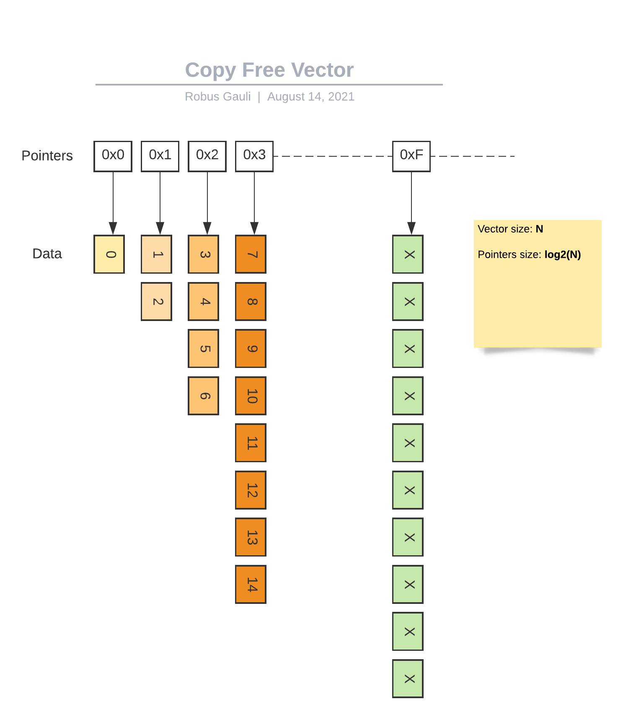

# cvector(1)

  Generic vector implementation with iterator helper in C. Also included <b>copy free</b> implemenation of vector.

***
`zero.h` is copy free vector implementation i.e there is no copy when size exceeds capacity.

## Copy Free Vector Representation (zero.h)


***

## Installation

  It has a two header files file called `cvector.h` and `zero.h`. You can simply copy/paste in your source directory to get started. You can also install via clib (package manager for C).

  With [clib](https://github.com/clibs/clib):
  ```sh
  clib install robusgauli/cvector
  ```


## About

Vector/List is fundamental data structure for just about anything. Therefore, I wanted something similar to what we have in other languages in C. Also, it includes `iterator` for free which allows you to do pretty interesting stuff such as peek, next, done, etc.

## Usage

### Simple example
```c
#include "cvector.h"

int main() {
    // Initialize
    int* numbers = NULL;

    // Push number to the list
    vector__add(&numbers, 1);
    vector__add(&numbers, 2);
    vector__add(&numbers, 3);

    // Size of the vector
    printf("Size is: %ld\n", vector__size(numbers));
    // Cap of the vector
    printf("Cap is: %ld\n", vector__cap(numbers));

    // Iterate over the numbers
    for (int i = 0; i < vector__size(numbers) i++) {
        int* number = &(numbers[i]);
        printf("Number: %d\n", *number);
    }
}
```

### Example using copy free vector

```c
#include <assert.h>

#include "zero.h"

int main() {

  typedef struct {
    int x;
    int y;
  } node_t;

  node_t *nodes = NULL;

  zero__add(node_t *, nodes, ((node_t){.x = 3, .y = 5}));
  zero__add(node_t *, nodes, ((node_t){.x = 6, .y = 7}));

  {
    node_t *node = zero__index(nodes, 0);
    assert(node->x == 3);
    assert(node->y == 5);
  }

  {
    node_t *node = zero__index(nodes, 1);
    assert(node->x == 6);
    assert(node->y == 7);
  }

  {
    node_t *more_nodes = NULL;
    for (int i = 0; i < 1000; i++) {
      zero__add(node_t *, more_nodes, ((node_t){.x = i * i, .y = i * i * i}));
    }

    for (int i = 0; i < zero__size(more_nodes); i++) {
      node_t *node = zero__index(more_nodes, i);
      assert(node->x == i * i);
      assert(node->y == i * i * i);
    }
  }
}
```

### With Iterator

NOTE: Iterator is not available for copy free implementation.
```c
#include "cvector.h"

int main() {
    // Initialize
    int* numbers = NULL;

    // Push number to the list
    vector__add(&numbers, 1);
    vector__add(&numbers, 2);
    vector__add(&numbers, 3);

    // Peek the value
    vector_iterator_t iterator = vector_iterator__new(numbers);
    for (;;) {
        if (vector_iterator__done(&iterator)) {
            break;
        }
        int* number = vector_iterator__next(&iterator);
        printf("Number: %d", *num);
    }
}
```

### Using struct
```c
#include "cvector.h"

struct Node {
  int x;
  int y;
};

int main() {
  struct Node* nodes = NULL;

  // Add to the list
  vector__add(&nodes, ((struct Node){.x=1, .y=1}));
  vector__add(&nodes, ((struct Node){.x=2, .y=2}));

  // Iterate
  vector_iterator_t iterator = vector_iterator__new(nodes);
  for (;;) {
    if (vector_iterator__done(&iterator)) {
      break;
    }

    struct Node* node = vector_iterator__next(&iterator);
    printf("X val of node is: %d\n", node -> x);
    printf("Y val of node is: %d\n", node -> y);
  }
}
```
